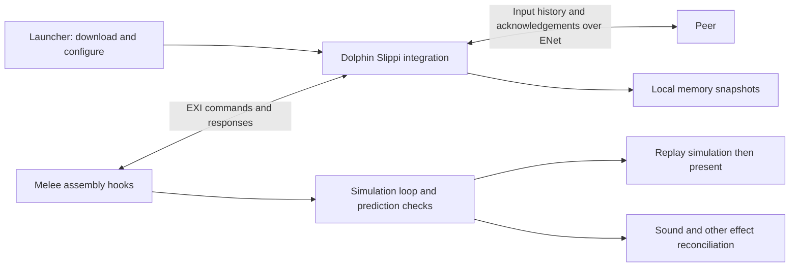

# Slippi rollback: verified implementation and OpenSmash plan

Research date: September 9, 2026. This is a source inspection and engineering proposal, not a completed Melee rollback implementation or a live Slippi benchmark. “Swifty” in the request is interpreted as Slippi.

**We can read the supplied disk image, and enough of Slippi's implementation is public to understand and reproduce its architecture.** The valuable work is in its game integration: carefully chosen snapshots, exact input history, repeated simulation, presentation reconciliation, and pacing. Slippi's client rollback implementation is already open source. OpenSmash's opportunity is a browser-capable implementation with reusable interfaces and reproducible correctness/performance evidence.

## 1. What the disk image establishes

Inspected `/Users/luis/Documents/Slippi-Launcher-2.15.1-arm64.dmg` by mounting it read-only with `hdiutil attach -readonly -nobrowse -noautoopen`. No Slippi application or executable was launched.

| Observation | Verified value |
|---|---|
| File length | 122,713,749 bytes |
| SHA-256 | `9107a522d0350da42f0f2c0d2bbd80a5bc9d74ced850e3272ecc28a242181ac9` |
| Bundle version | 2.15.1 |
| Bundle identifier | `com.github.projectslippi.slippidesktopapp` |
| Package | Electron application; `app.asar` and unpacked JavaScript bundles |
| ASAR entries | 1,845 |
| Emulator files | No Dolphin executable or Dolphin-named asset found on the image or in the ASAR index |

The size and digest match the ARM64 DMG asset reported by the official [v2.15.1 release](https://github.com/project-slippi/slippi-launcher/releases/tag/v2.15.1), published August 31, 2026. This verifies a byte-identical release download; it is not an application security audit.

The packaged `main.js` contains the `GetLatestDolphin` query and both `Slippi Dolphin.app` and `Slippi_Dolphin.app` installation paths. The public launcher source fetches emulator versions/download URLs and supports both Ishiiruka and the newer Dolphin fork. Consequently, **launcher version 2.15.1 does not uniquely identify the emulator or netcode version subsequently downloaded**. [Version lookup][launcher-version], [installation selection][launcher-manager].

The source revisions below are independently inspected branch snapshots. They have not been established as the exact emulator build selected by this launcher on a particular account/channel.

## 2. Public source and confidence

| Component | Inspected revision | Purpose |
|---|---|---|
| `project-slippi/dolphin`, branch `slippi` | `41a7a3a110ed52999486ae1901c8fbb9a63d4f13` | Modern Dolphin integration |
| `project-slippi/Ishiiruka`, branch `slippi` | `e9d048ac6f2d77f96fcd1c0b04bc1533a7ff81e1` | Older Dolphin fork and useful reference |
| `project-slippi/slippi-ssbm-asm`, `master` | `fcf47f10dc244152c2ebaa3a9dec142ea42243b7` | Melee engine hooks and rollback control |
| `project-slippi/slippi-launcher`, `main` | `309e99760bea333fe6665d8d9fa06dab540ff377` | Downloading, configuration, application orchestration |

The [maintainer's getting-started document][wiki] explicitly points to the assembly and emulator repositories for rollback, and EXI for their communication. It describes matchmaking server code as private. Public client code lets us inspect the connection flow; it does not establish the complete production server implementation or enforcement policies.

The core behavior is well understood from executable source, but documentation is distributed across code, comments and the wiki. Some comments explicitly record uncertainty about memory exclusions, controller queues, and camera fast-forward behavior. Treat this as a mature implementation with detailed public evidence, not a formal correctness proof.

License metadata also matters to the proposed open-source project: the assembly and launcher carry GPL-3.0 licenses; Ishiiruka identifies GPL-2.0, with relevant source headers saying GPLv2+; modern Dolphin's `COPYING` describes a GPLv3-compatible aggregate with per-file licensing. These are source observations, not a conclusion about the licensing of a future combined distribution. Preserve component provenance when choosing reuse. [Assembly license][asm-license], [Dolphin licensing][dolphin-license].

## 3. How the pieces cooperate



The emulator handles transport and copying memory. The Melee hooks decide which inputs to use, detect incorrect predictions, request restoration, and repeat the game update loop. The launcher is outside the per-frame algorithm. Read [EXI handlers][exi], [input hook][inputs], and [engine loop][loop] together; none alone explains the complete system.

### Input prediction and correction

1. Record local input and assign it to a simulation frame after the configured input delay.
2. Send it with recent input history. Preserve local inputs for subsequent replay.
3. Use real remote input when available; otherwise repeat the most recently received remote input and record that prediction.
4. Compare later arrivals against the inputs actually predicted for those frames.
5. Find the earliest disagreement across remote players, restore the corresponding state, and simulate forward with corrected inputs.
6. If the allowed lead over remote input is exhausted, wait for more input.

This is ordinary input prediction, not an AI model. The inspected input hook also avoids unnecessary rollbacks: it masks irrelevant button bits, compares the four stick bytes, and treats both trigger values at or below 42 as equivalent. A separate normalization zeros tiny stick-at-rest noise when both axes are within ±2. The comments explain why larger stick differences cannot simply be ignored under UCF. These are **Melee-specific input semantics**, not constants to transplant into Smash 64. [Input comparison and prediction][inputs].

The modern Dolphin default input delay is **2 frames**. Assembly permits 1–15. Both the assembly and C++ declare **7 rollback frames**. These are distinct knobs: delay provides time for packets to arrive; the rollback window bounds speculative history and recovery work. More history does not eliminate visible corrections or provide a latency guarantee. [Default delay][settings], [assembly constants][constants], [C++ limits][net-header].

For illustration: with state saved before each frame, if we have reached frame 106 and discover the remote input used at frame 102 was wrong, restore state 102 and rerun 102–105 before continuing. This is explanatory indexing; Slippi also has its own startup, raw-input, and replay-file frame conventions.

### The snapshot is deliberately specialized

`SlippiSavestate::Capture()` copies selected emulated RAM regions. They cover selected data/BSS areas, another memory range, and the main game heap, whose boundaries are read from Melee. Sound-related regions and VI/XFB memory are excluded. The full Dolphin state serialization calls in this rollback class are commented out. It is **not** an ordinary CPU/DSP/GPU/device save state. [Snapshot implementation][snapshot].

At load, designated preservation blocks are backed up, the older game memory is restored, then those preservation blocks are reinstated. Initialization identifies the online data buffer, receive buffer and snapshot control buffer as preserved. Newly received network information therefore survives restoration. [Preservation setup][init], [load hook][load].

This works in cooperation with game hooks at known execution points. `StartEngineLoop` also repairs the raw controller queue after restoration because the saved frame already contained predicted raw input. Copying the same memory addresses into another runtime, or restoring arbitrary memory while workers continue running, does not reproduce that contract. [Engine entry][start].

Engineering implication: retain two separate histories—rewindable game state and the input/network timeline that has learned new facts. A rollback must not erase the packet that caused the correction.

### Fast-forward still includes gameplay-affecting camera work

`LoopEngineForRollback.asm` branches back into the game update loop until it reaches the rollback endpoint. Intermediate updates avoid normal frame rendering. However, it explicitly invokes camera tasks. The shared fast-forward macro updates camera-dependent values and fighter offscreen flags. [Engine loop][loop], [camera macro][camera].

This is a subtle porting requirement: “skip drawing” must not mean “skip every function normally reached while drawing.” Camera state can affect offscreen gameplay, tags and other later calculations. The macro comments even describe the performance and visual problems with invoking the larger parent routine. Preserve required behavior, then optimize the expensive presentation work.

### Sound is reconciled, not simply rewound

Slippi maintains sound logs for frames, including sound and playing-instance identifiers. During resimulation, sounds already present in the prior log are not played again. Sounds belonging to actions cancelled by correction are stopped; new sounds can be played. The inspected code has an explicit exception for the hammer sound cleanup trigger. [Duplicate suppression][sound], [instance tracking][sound-instance], [cancelled-sound handling][loop].

This is more complete than muting every replayed frame. Blanket muting prevents duplicated audio but can omit a sound that only exists in the corrected history. For OpenSmash, a reusable frame/event identity and reconciliation layer is a useful later target; audio samples already heard cannot be literally taken back.

### Network transport and loss recovery

Slippi uses ENet. Input traffic is unsequenced, while other message types can use reliable delivery. A pad message carries a frame, player index, confirmed checksum information, and a sequence of pad samples; each transmitted sample uses **8 bytes**. Sender history is retained according to acknowledgements from active peers, with a defensive limit on how far the retained history may extend. Receiving later bundles can fill earlier gaps. [Transport and queues][net], [pad layout][pad].

The reusable principle is to send compact, frame-addressed, redundant inputs. The network principally transports inputs, not a full state snapshot each frame. Slippi's local memory layout need not become OpenSmash's network format.

### Pacing is separate from determinism

Peers must also avoid drifting apart in real time. `CalcTimeOffsetUs()` sorts collected offset samples and averages their middle portion. The emulator periodically adjusts pacing, with explicit branches for limited slowing, acceleration, startup waiting and additional simulation advances. At the inspected revision, speed adjustment can range from approximately 99.5% to 101%; these are implementation tuning choices. [Offset calculation][net], [pacing implementation][exi].

For our port, change when fixed simulation steps run, not the amount of game time represented by an individual step. Measure one-sided rollback and frame lead as well as RTT. Copying a predictor alone leaves this part unsolved.

### Deterministic loading and stage behavior

Initialization synchronizes the starting RNG value and match setup. Other hooks address asynchronous file activity. Current source includes an EXI-based path for preloaded Stadium transformations, plus separate music hooks. Historical explanations that rollback inherently requires permanently disabled music or a permanently frozen Stadium are not an adequate description of all current code paths. [Initialization][init], [Stadium loading][stadium], [music hook][music].

For the browser version, prepare required assets before speculative gameplay, and make resource completion independent of the rewound simulation. Background network requests, newly allocated host objects and live worker synchronization cannot be casually included in a memory snapshot.

### Desync detection and irreversible outcomes

The assembly builds a diagnostic from selected fighter data, including stocks, action state, positions, damage and spawn number. It combines a warning checksum with a position/damage sum for tolerance-based hard-desync handling. This is not a complete state hash or an anti-cheat proof. Game completion also waits beyond the rollback window before invoking the completion handler. [Checksums and completion][start].

If “well-enforced” means correctness safeguards: bounded history, prediction comparisons, input checks, desync diagnostics and delayed completion are visible in source. If it means independently proven security or server-side anti-cheat guarantees: this inspection does not establish that. Two clients can agree on a diagnostic while differing elsewhere.

Slippi's `.slp` replay format is separately documented with game settings and frame events. It is useful for analysis and reproducibility, but is not the live in-memory snapshot format used to undo speculative simulation. [Replay specification][replay-spec].

## 4. Comparison with this workspace

There are two different targets. `yougame/` is the BattleShip-based native Smash 64 port compiled to Wasm. `melee/` is the separate Melee recompilation/runtime. Their snapshot adapters must differ.

| Concern | Existing Smash 64 / YouGame implementation | Melee requirement |
|---|---|---|
| Input timeline | `room.rollback`, 60 Hz, delay 2, window 10 | Reuse a timeline controller once exact stepping works |
| Snapshot storage | Local immutable 16 KiB pages; SDK stores a small JSON handle and diagnostic | Define state ownership and a coordinated restoration boundary |
| Startup | Neutral warmup, build/seed/fighter/stage agreement | Establish exact matching initial game state and input polling |
| Restoration | Native captured memory, exclusions, bounded history | Prove game RAM and runtime control state remain consistent |
| Effects | Clear queued audio and suppress submissions during replay | Reconcile audio; retain required camera/gameplay work |
| Results | Speculative KO held until beyond the rollback horizon | Same confirmed-completion principle |
| Integrity | Fighter/RNG/stock diagnostic rather than complete canonical state | Stronger development diagnostics and reproducible traces |

These observations come from the current local files: [rollback session](../yougame/src/rollback-session.mjs), [engine adapter](../yougame/src/rollback-engine.mjs), [snapshot store](../yougame/src/checkpoints.mjs), [runtime bridge](../yougame/src/engine.html), [Smash 64 notes](../yougame/ROLLBACK.md), and [Melee status](../melee/ROLLBACK.md). Existing working-tree edits were preserved.

**Current YouGame SDK verification:** fetched `https://yougame.co/sdk.js`, SHA-256 `f700ac80dee61950cdb6868cb9d22ddffbbf488b67433f032129fda33edf5c9d`, and read the connected developer reference. Its room connection uses WebSocket. `makeSync` stores snapshots, repeats remote input, corrects the earliest mismatched prediction, and resimulates. In rollback mode it hashes the JSON returned by `save()` after relevant inputs are confirmed; a separate `checksum` callback is not used. Thus a local native handle must include deterministic diagnostics, never peer-specific pointers or opaque random identifiers. [SDK reference](https://yougame.co/sdk.md), [SDK implementation](https://yougame.co/sdk.js).

WebSocket's ordered delivery can make a lost transport segment delay later inputs. Redundant application messages do not remove that transport constraint. An unordered WebRTC data channel is a possible future transport experiment, with signalling/relay requirements and separate reliable control messages; it is not a change established as necessary by these measurements. First measure the current path under real latency, jitter and loss. [Data channel ordering](https://developer.mozilla.org/en-US/docs/Web/API/RTCDataChannel/ordered).

The focused existing tests passed against this downloaded SDK: **9 passed, 0 failed, 0 skipped**. They cover snapshot retention/restoration, exact page comparison, simulated delayed/lost input bundles, speculative KO cancellation and failure handling. This run did not execute a real Melee engine, a live Internet match, or a physical phone.

Prior local [checkpoint benchmarks](rollback-performance-2026-09-09.md) show why headroom matters. The newer [Melee comparison](../melee/PORT-COMPARISON.md) records roughly 39–41 displayed FPS in its specific Onett scenario; other scenarios have different results. Neither a successful save/load smoke test nor one near-60-FPS scene establishes rollback readiness.

## 5. Recommended implementation path

**Begin with an exact Melee frame-step and rewind harness.** Slippi's game-level approach is worth prototyping before assuming we must serialize the entire emulator. Its narrower state model could substantially reduce checkpoint cost. This is an inference from Slippi's architecture, not a demonstrated capability of our runtime.

Two routes should be evaluated at that first gate:

| Route | What it requires | Main tradeoff |
|---|---|---|
| Slippi-style game-level restoration | Adapt the engine/input/camera/effect hooks; preserve host and online state at matching boundaries | Potentially compact/fast, but deeply dependent on Melee behavior and the recompilation runtime |
| Coordinated full runtime checkpoint | Freeze workers and serialize canonical CPU/device/game state while excluding host resources | Broader state coverage, but potentially much more expensive and still needs presentation handling |

Do not use a blind copy of the shared Wasm heap as either implementation. It can contain active stacks, worker coordination and host-facing state. Start with one deterministic execution configuration; reintroduce concurrency only when restoration ownership is explicit.

Suggested engine contract, independent of matchmaking provider:

```text
prepare(matchConfig, contentFingerprint, seed)
capture(frame) -> immutable local checkpoint
restore(checkpoint)
simulateFrame(frame, inputs, replaying) -> events
present()
hashCanonicalState(frame) -> diagnostic
reconcileEffects(previousEvents, correctedEvents)
disposeCheckpoint(checkpoint)
```

The reusable rollback controller owns input histories, predictions, confirmation, replay ranges and retention. Engine adapters own snapshots and stepping. Transport adapters own delivery. YouGame supplies rooms, identity, matchmaking and results. This lets an open-source core run in a local two-peer test without a YouGame account and later use different transports without reworking game restoration.

The following gates make the next work reviewable:

1. **Deterministic replay:** from one prepared match, capture before a frame, run recorded inputs, restore, then rerun. Compare canonical state every frame. Cover one through seven-frame rewinds and repeated corrections. Verify raw input history, RNG and timers explicitly.
2. **Two independent engines:** same build/configuration/seed/input log, comparing state at confirmed frames. Include transformations, secondary fighters, projectiles, hitlag, grabs, moving stages, respawns and match completion. Add stronger subsystem hashes than the existing small diagnostic.
3. **Presentation equivalence:** verify camera/offscreen behavior with intermediate rendering suppressed. Test sounds created, duplicated and cancelled by a correction; test rumble and other irreversible effects separately.
4. **Recovery cost:** measure save, restore, replay and presentation distributions at depths 0, 1, 3 and 7 on each target device. Increasing the window is allowed only after those measurements.
5. **Network stress:** exercise delayed, duplicated, reordered and lost input messages, asymmetry, burst loss, reconnect/rematch boundaries and browser suspension. Ensure old-round packets cannot enter the current timeline.
6. **Hosted validation:** use two distinct test identities/devices, actual Casual/Ranked/Friends entry, agreed results and rematches. Treat server result agreement separately from engine determinism or anti-cheat.

For a correction of depth `k`, an approximate serial budget is:

```text
restore + k × (simulation + replacement snapshot)
        + current-frame work + presentation + input/network overhead
```

At a nominal 60-Hz display the interval is about 16.67 ms. Illustratively, seven corrected frames plus one new frame at 2 ms each already cost 16 ms before the remaining overhead. This is a budget example, not a measurement of either engine. A game merely reaching 60 FPS without rollback has not established enough recovery headroom.

For Smash 64, retain the existing adapter as the reference and improve measured replay/render separation, effect reconciliation and diagnostics. For Melee, the immediate deliverable should be the offline rewind harness plus timing evidence, followed by the online adapter. A larger prediction window or a transport replacement cannot compensate for incorrect restoration or insufficient simulation speed.

## 6. Reading order and evidence

Recommended source reading order: [input hook][inputs] → [engine entry][start] → [simulation loop][loop] → [snapshot implementation][snapshot] → [preservation setup][init] → [network client][net] → [sound deduplication][sound] → [camera tasks][camera]. Use both emulator forks for comparison; line references in this report principally target modern Dolphin.

For a separate generic reference, [GGPO](https://github.com/pond3r/ggpo) publishes an MIT-licensed rollback SDK, documentation and a sample. Its existence does not establish that Slippi embeds GGPO, and it does not supply Melee's snapshot boundary or effect fixes.

The adjacent `slippi-rollback-sources-2026-09-09.json` records fixed GitHub revisions, downloaded-source hashes, release evidence, the SDK hash and fingerprints of compared local files. Downloaded source is temporarily retained under `/tmp/opensmash-slippi-research`; GitHub commit URLs in the manifest remain the reproducible source of record. No upstream code was added to production and no build was published during this research.

[wiki]: https://github.com/project-slippi/slippi-wiki/blob/master/GETTING_STARTED.md
[replay-spec]: https://github.com/project-slippi/slippi-wiki/blob/master/SPEC.md
[launcher-version]: https://github.com/project-slippi/slippi-launcher/blob/309e99760bea333fe6665d8d9fa06dab540ff377/src/dolphin/install/fetch_latest_version.ts
[launcher-manager]: https://github.com/project-slippi/slippi-launcher/blob/309e99760bea333fe6665d8d9fa06dab540ff377/src/dolphin/manager.ts
[exi]: https://github.com/project-slippi/dolphin/blob/41a7a3a110ed52999486ae1901c8fbb9a63d4f13/Source/Core/Core/HW/EXI/EXI_DeviceSlippi.cpp
[snapshot]: https://github.com/project-slippi/dolphin/blob/41a7a3a110ed52999486ae1901c8fbb9a63d4f13/Source/Core/Core/Slippi/SlippiSavestate.cpp
[net]: https://github.com/project-slippi/dolphin/blob/41a7a3a110ed52999486ae1901c8fbb9a63d4f13/Source/Core/Core/Slippi/SlippiNetplay.cpp
[pad]: https://github.com/project-slippi/dolphin/blob/41a7a3a110ed52999486ae1901c8fbb9a63d4f13/Source/Core/Core/Slippi/SlippiPad.h
[net-header]: https://github.com/project-slippi/dolphin/blob/41a7a3a110ed52999486ae1901c8fbb9a63d4f13/Source/Core/Core/Slippi/SlippiNetplay.h
[settings]: https://github.com/project-slippi/dolphin/blob/41a7a3a110ed52999486ae1901c8fbb9a63d4f13/Source/Core/Core/Config/MainSettings.cpp#L39
[inputs]: https://github.com/project-slippi/slippi-ssbm-asm/blob/fcf47f10dc244152c2ebaa3a9dec142ea42243b7/Online/Core/TriggerSendInput.asm
[start]: https://github.com/project-slippi/slippi-ssbm-asm/blob/fcf47f10dc244152c2ebaa3a9dec142ea42243b7/Online/Core/StartEngineLoop.asm
[loop]: https://github.com/project-slippi/slippi-ssbm-asm/blob/fcf47f10dc244152c2ebaa3a9dec142ea42243b7/Online/Core/LoopEngineForRollback.asm
[init]: https://github.com/project-slippi/slippi-ssbm-asm/blob/fcf47f10dc244152c2ebaa3a9dec142ea42243b7/Online/Core/InitOnlinePlay.asm
[load]: https://github.com/project-slippi/slippi-ssbm-asm/blob/fcf47f10dc244152c2ebaa3a9dec142ea42243b7/Online/Static/LoadState.asm
[constants]: https://github.com/project-slippi/slippi-ssbm-asm/blob/fcf47f10dc244152c2ebaa3a9dec142ea42243b7/Online/Online.s
[camera]: https://github.com/project-slippi/slippi-ssbm-asm/blob/fcf47f10dc244152c2ebaa3a9dec142ea42243b7/Common/FastForward/FunctionMacros.s
[sound]: https://github.com/project-slippi/slippi-ssbm-asm/blob/fcf47f10dc244152c2ebaa3a9dec142ea42243b7/Online/Core/Sound/PreventDuplicateSounds.asm
[sound-instance]: https://github.com/project-slippi/slippi-ssbm-asm/blob/fcf47f10dc244152c2ebaa3a9dec142ea42243b7/Online/Core/Sound/AssignSoundInstanceId.asm
[stadium]: https://github.com/project-slippi/slippi-ssbm-asm/blob/fcf47f10dc244152c2ebaa3a9dec142ea42243b7/Online/Core/Hacks/Stadium/StadiumFileLoad.asm
[music]: https://github.com/project-slippi/slippi-ssbm-asm/blob/fcf47f10dc244152c2ebaa3a9dec142ea42243b7/Online/Core/Music/StartSong.asm
[asm-license]: https://github.com/project-slippi/slippi-ssbm-asm/blob/fcf47f10dc244152c2ebaa3a9dec142ea42243b7/LICENSE
[dolphin-license]: https://github.com/project-slippi/dolphin/blob/41a7a3a110ed52999486ae1901c8fbb9a63d4f13/COPYING
